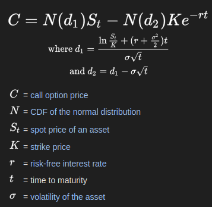

# OpenMP Parallel Financial Monte Carlo Simulator

This project implements a high-performance Monte Carlo simulation engine in C++ using OpenMP to price complex financial derivatives based on the Black-Scholes model.

## Technologies
- C++
- OpenMP
- Python (for visualization)
- Makefile

## Background
### What are financial deratives?
Financial derivatives is a contract between two parties whose value is derived from an underlying asset (such as a stock, bond, or commodity). In some types like futures and forwards, one party agrees to buy an asset at a predetermined price and future date. Put simply, it can be like a bet, but often serves other purposes like risk management. The parties may have different motivations. One might bet that the asset will increase in value, while the other bets that the asset will decrease in value. If the asset depreciates below the agreed price, then the seller benefits because they sold it at a higher price than current market value. If the asset increases in value above the agreed price, then the buyer benefits because they secured it at a lower price than current market value. The special thing about derivatives is that it can be used as a trading tool, which is a key factor. 

#### How can it be used to manage risks?
Imagine Shakur Stevenson announces a fight happening in 6 months. You can:
Option 1 (No Derivative): Wait until the day of the fight and buy tickets at whatever price they are selling for then - could be cheap if nobody wants to go or extremely expensive if sold out.
Option 2 (Futures Contract): By the ticket today at a fixed price of $100, locking in the price.

By going with option 2, you might be worried that the price of the ticket will skyrocket in the future, so you lock in your price by paying now at today's price. However, if the ticket's value depreciates, you end up paying more.

### What is the Monte Carlo Simulation?

Monte Carlo Simulation is a way to estimate the answer to a complex problem by using random numbers and repeating an experiment many times. For example, let’s say we want to calculate the area of a circle, but we don’t know the formula A=πr^2.

Instead, we draw a rectangle that completely contains the circle. Since we know how to calculate the area of a rectangle (length × width), we generate random points inside the rectangle. Some of those points will fall inside the circle, and some will fall outside. We use the ratio of points that fall inside the circle vs points that fall outside the circle and multiply it by the area of the rectangle. We know that a point has landed inside the circle using the formula: x² + y² ≤ 1. The more points we generate, the better our estimate becomes.

\[
\frac{\text{Points inside circle}}{\text{Total points}} \times \text{Area of rectangle} \approx \text{Area of the circle}
\]

#### Estimating Pi with Monte Carlo

One of the simplest and most elegant uses of Monte Carlo simulation is estimating the value of π using the unit square.

##### Unit Square  
A square with side length 1, giving an area of 1.

##### Quarter Circle  
A quarter of a unit circle (radius = 1) is inscribed within the square.  
- Full circle area: \( \pi \times r^2 = \pi \times 1^2 = \pi \)  
- Quarter circle area: \( \frac{\pi}{4} \)

##### Random Sampling  
Random points are generated within the unit square. Each point has an \( x \) and \( y \) coordinate between 0 and 1.

A point \( (x, y) \) falls inside the quarter circle if:
\[
x^2 + y^2 \leq 1
\]
This condition comes from the equation of a circle centered at the origin with radius 1.

##### Why This Works  
Because the quarter circle is fully contained within the square, the ratio of points that fall inside the circle to the total number of points approximates the ratio of their areas:
\[
\frac{\text{Points inside quarter circle}}{\text{Total points in square}} \approx \frac{\pi}{4}
\]

Solving for π gives the estimation formula:
\[
\pi \approx 4 \times \left( \frac{\text{Points inside quarter circle}}{\text{Total points}} \right)
\]

The accuracy of the estimate improves as the number of sampled points increases.

The code for this is provided in the root directory and can be ran with `g++ estimating_pi.cpp`; `./a.out`.

### What is the Black-Scholes Model?
The Black-Scholes Model is a mathematical formula used to calculate the value of an option based on several parameters. These parameters include the asset’s current price, strike price, time to expiration, volatility, and the risk-free interest rate. For example, if a buyer wants to know whether an option is worth purchasing, they can use this formula to estimate its fair value.

Below is the formula:

\[
S_{\text{next}} = S \times e^{\left( \mu - \frac{1}{2} \sigma^2 \right) \Delta t + \sigma \sqrt{\Delta t} \cdot Z}
\]

### Putting it all together
Our Monte Carlo simulation engine helps us estimate the value of options by simulating many possible future price scenarios for the underlying asset.

Here’s how it works:

1. Start with today’s asset price.

2. Use the Black-Scholes assumptions to model how the price might change over small time steps into the future.
   This includes factors like volatility (how much the price can fluctuate) and expected return.

3. At each small time step, we apply the formula:

   \[
   S_{\text{next}} = S \times e^{\left( \mu - \frac{1}{2} \sigma^2 \right) \Delta t + \sigma \sqrt{\Delta t} \cdot Z}
   \]

   where \( Z \) is a random number that introduces unpredictable “shocks” or changes to the price.

4. Repeat this step-by-step price update many times to create one possible "path" of how the price might move over time (this is where the multithreading optimization comes in).

5. Simulate thousands or millions of these paths. Each one represents a different possible future for the asset price, capturing the uncertainty and randomness of the market.

6. For each simulated path, calculate the payoff of the option (how much it would be worth at expiration).

7. Average all those payoffs together to estimate the expected value of the option today.

## User Input
Current asset price (S₀) -> the price of the underlying asset today

Strike price (K) -> the price at which the option can be exercised

Time to expiration (T) -> usually in years (e.g., 0.5 for 6 months)

Volatility (σ) -> annualized standard deviation of the asset’s returns (e.g., 0.2 for 20%)

Risk-free interest rate (r) -> annualized risk-free rate (e.g., 0.05 for 5%)

Number of simulation paths -> how many random price paths to generate (more paths → more accurate results but slower)

Number of time steps per path -> how many small intervals to split the total time T into (e.g., 252 for daily steps in a year). When simulating a price path from today until option expiration, you break the total time period into small intervals, called time steps. Instead of jumping directly from the start price to the end price in one go, you simulate the price step-by-step, moving forward a little bit at a time.
